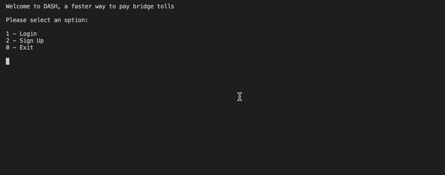
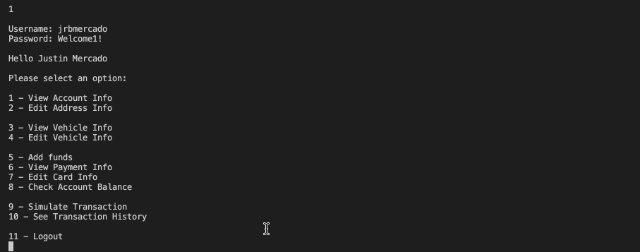
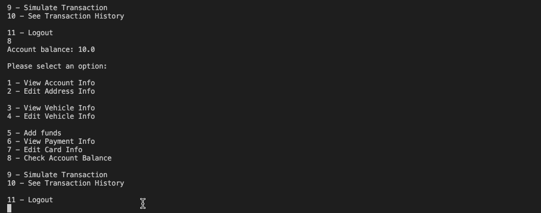

# Dash
A faster way to collect bridge tolls.

## Purpose
Developed for Software Engineering Group Project.

## Installation Instructions

## Tools Used
1. Java
2. JUnit

## Features
**Login with Password**
- Access your account information only with the correct login credentials!

**Edit Account Info**
- Recently moved address? Update your address info to avoid having problems with your account.

**Edit Vehicle Info**
- View and make changes to the vehicles on file to ensure your account gets billed properly every time you cross.

**Manage Account Balance**
- Add funds to account using the credit card on file.
- Edit payment information and update card details.
- Check account balance.

**Simulate Transactions**
- Simulate crossing the many bridges throughout the Bay Area, each with different toll amounts.
- Check transaction history, seeing the toll cost and what bridge was crossed.

